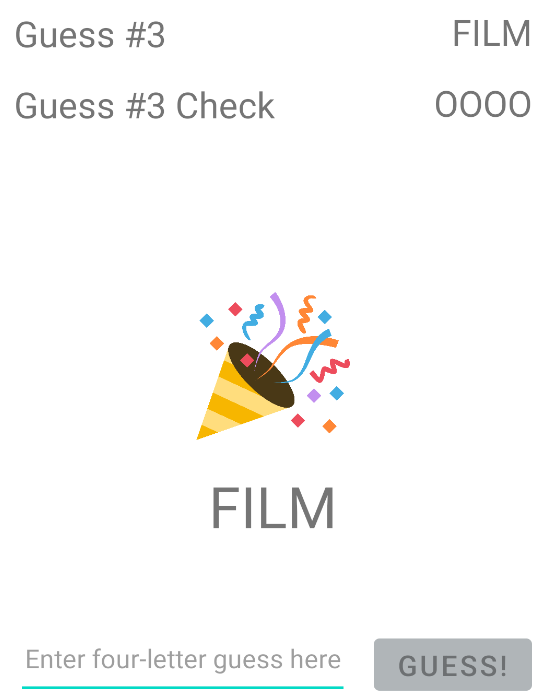

# Android Project 1 - *SimpleWordle*

Submitted by: **Pooja Ganapathy**

**SimpleWordle** is an Android app that recreates a simple version of the popular word game [Wordle](https://www.nytimes.com/games/wordle/index.html). 

Time spent: **8** hours spent in total

## Required Features

The following **required** functionality is completed:

- [X] **User has 3 chances to guess a random 4 letter word**
- [X] **After 3 guesses, user should no longer be able to submit another guess**
- [X] **After each guess, user sees the "correctness" of the guess**
- [X] **After all guesses are taken, user can see the target word displayed**

The following **optional** features are implemented:

- [ ] User can toggle betweeen different word lists
- [ ] User can see the 'correctness' of their guess through colors on the word 
- [X] User sees a visual change after guessing the correct word
- [ ] User can tap a 'Reset' button to get a new word and clear previous guesses
- [X] User will get an error message if they input an invalid guess
- [ ] User can see a 'streak' record of how many words they've guessed correctly.

The following **additional** features are implemented:

* [X] Automatically prevents user from entering more than 4 characters
* [X] User input is cleared and keyboard is hidden after each valid guess

## Video Walkthrough

Here's a walkthrough of implemented user stories:

GIF created with LiceCap. 

This is an additional screenshot showing what happens when the user guesses the word correctly:

## Notes

This app was fun to build and required more coding than the previous apps. It took some time to get the layout right but apart from that, there were no difficulties.

## License

    Copyright [2022] [Pooja Ganapathy]

    Licensed under the Apache License, Version 2.0 (the "License");
    you may not use this file except in compliance with the License.
    You may obtain a copy of the License at

        http://www.apache.org/licenses/LICENSE-2.0

    Unless required by applicable law or agreed to in writing, software
    distributed under the License is distributed on an "AS IS" BASIS,
    WITHOUT WARRANTIES OR CONDITIONS OF ANY KIND, either express or implied.
    See the License for the specific language governing permissions and
    limitations under the License.
